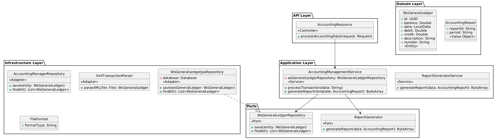

#  Accounting Data Managment
 

### Problem scope:
— Accounting data is imported from several external accounting pieces of software. They provide, usually through REST services, data in XML, JSON of CSV format.
— Accounting data consists of series of balanced transactions (null sum of amounts). Each transaction has an amount, a chart of accounts hierarchical numerical code (which can differ depending on the company countries — for instance in France revenue accounts start with 7, whereas UK revenue accounts usually start with 4), a date, a label...
— After import, this data must be stored in a local SQL database.
— Among the features of the software, it should be able to output summarized reports, at least balance and P&L, aggregated on specific categories, defined as a set of roots in the CoA (for instance, 71xxxx and 73xxxx, or 6xxxxx). Any balance report should have assets = liabilities.
— The report should be displayed, and exportable to Excel format. Several report templates (with different charts of accounts and different mappings from CoA to aggregated categories) can be defined and used.
— The software should be written for the Java platform (Java, Kotlin or Scala). Its UI should be a rich internet application, compatible with most recent browsers.
Design (in UML form)
— a data model
— a services model
— an architectural blueprint, with recommendation for Java/Kotlin libraries and frameworks to be used. — argument your choices, and identify possible performance issues and solutions.
Expected outcome:
The software should scale to tens of accounting data providers, hundreds or thousands of companies with up to 30 years accounting data, and hundreds of users.
• Provide the definition of the most relevant interface contracts (in Java or Kotlin)
• Provide a code snippet to parse XML transaction data (you can define the XML schema or use the
attached sample file).
• Provide one or a few test cases dealing with the parser and a Gradle build script to build and execute
the code snippet.

### -  Analysis and solution approach

Based on the problem we are working on an accounting management system,
which deals with financial transactions, ledgers, and reports.
I used Hexagonal Architecture so I can separate the Business Logic from Infrastructure


+ Domain Layer (domain package)
Contains Entities (WsGeneralLedger) and Value Objects (AccountingReport).
+ Application Layer (application package)
Contains Use Cases / Services (AccountingManagementService, ReportGeneratorService).
+ Ports (Interfaces) (ports package)
Defines abstractions (ImportService, ReportGenerator, WsGeneralLedgerRepository).
+ Infrastructure Layer (Adapters) (provider.database and provider.parser packages)
Implements repository adapters (WsGeneralLedgerJpaRepository, AccountingManagerRepository).
Implements file parsing (XmlTransactionParser, FileFormat).
+ API Layer (api package)
Defines external endpoints (AccountingResource).
```
WHY? this is my arguments
✅ Accounting logic is highly regulated, requiring strict validation rules and domain consistency.
✅ Supports DDD: Clear separation of domain models and persistence.
✅  I can change the database (e.g., move from JPA to MongoDB) without modifying business logic.
also it's faster, isolated unit tests that catch issues early before deployment.
```

### - Java libraries and frameworks 
-  Spring Boot: For dependency injection, REST API handling, and overall simplicity.
- Hibernate/JPA: For SQL database ORM.
- Jackson: For JSON/XML parsing.
-  Apache POI: For generating Excel reports.
- Gradle: For dependency management and builds.

### - Possible performance issues and solutions 🚀

+ Database: Use large datasets like PostgreSQL, MySQL or MongoDB are good choices.
+ Caching: Use Redis for caching frequently accessed reports.
+ Concurrent Users: Ensure thread safety in repositories; leverage connection pooling (HikariCP).
+ Batch Imports: Use async processing (e.g., Spring Batch) for large imports instead of importing the data.

+ Scalability for Real-Time Use Cases

  - Database Design:
```
Use partitioning and indexing in PostgreSQL to handle large datasets (e.g., partition by company and fiscal year).
Store transactions in a normalized schema, with aggregated tables for reporting.
```
  - Event-Driven Architecture:

```
Kafka ensures real-time propagation of imported transactions to downstream systems (e.g., for dashboards or audits).
```
  - Elastic Infrastructure:

Use container orchestration (e.g., Kubernetes) for auto-scaling the service to handle spikes in data imports or report requests.: 

##### Using commandline
You can build the project and run all tests in the terminal:(Tests are still not finished)
```
./gradlew bootRun
```

Note:
All scenarios are not implemented but I started some BDD scenarios 
Feature: XML Import Validation:
```
📌 Feature: Validate XML file during import

As an accounting system
I want to validate imported XML files
So that I can ensure data consistency and prevent incorrect records

Scenario: Import a valid XML file
Given a valid XML file "transactions.xml"
When the XML file is processed
Then the system should validate its structure
And the system should validate its content
And the system should confirm a successful import

Scenario: Import an XML file with a missing required field
Given an XML file with a missing "amount" field
When the XML file is processed
Then the system should detect the missing field
And the system should return an error message "Missing required field: amount"

Scenario: Import an XML file with incorrect data format
Given an XML file where "transactionDate" is not in the format "yyyy-MM-dd"
When the XML file is processed
Then the system should detect the incorrect format
And the system should return an error message "Invalid date format for transactionDate"

Scenario: Import an XML file with an unknown field
Given an XML file containing an extra field "randomField"
When the XML file is processed
Then the system should ignore the unknown field
And the system should proceed with the import

Scenario: Import an XML file with duplicate transactions
Given an XML file with duplicate transaction IDs
When the XML file is processed
Then the system should detect the duplicate entries
And the system should return an error message "Duplicate transaction ID found"

Scenario: Import an empty XML file
Given an empty XML file
When the XML file is processed
Then the system should return an error message "XML file is empty"

Scenario: Import an XML file with invalid schema
Given an XML file that does not match the expected XSD schema
When the XML file is processed
Then the system should reject the file
And the system should return an error message "XML structure does not match the expected schema"
```


